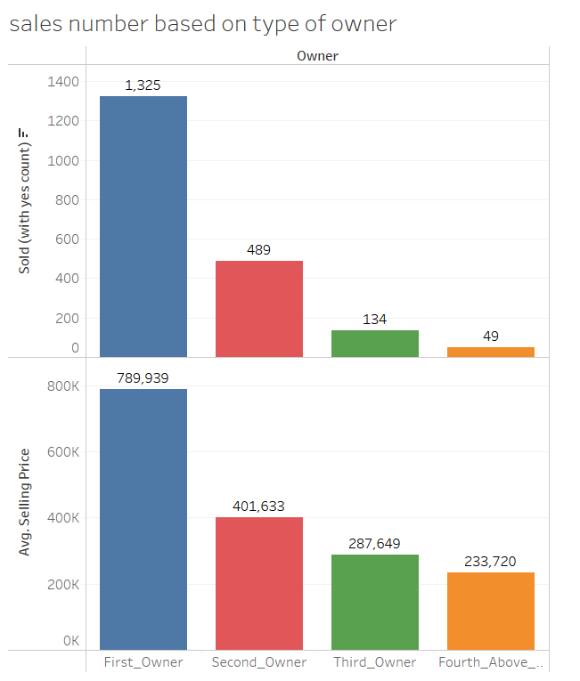

## Automobile Sales Forecasting: A Business Intelligence Case Study

### Background
A research project conducted as part of my MSc in Behavioral Economics and Decision Science. The study was based on a Kaggle dataset framed as a consulting-style case, where an Indian automobile company (XYZ) planned to enter the local used-car market. The project investigated how advanced data analytics and visualization techniques could be applied to forecast automobile sales trends and provide insights to guide market entry and competitive positioning.

### Research Question
- What factors influence used-car sales across brands, fuel types, locations, and ownership histories?  
- How can data visualization and forecasting techniques inform pricing and sales strategies in the automotive industry? 

### Key Skills
- **Data Visualization** (Tableau)  
- **Data Cleaning & Wrangling** (Microsoft Excel)  
- **Forecasting & Trend Analysis**  
- **Business Intelligence & Strategic Decision-Making**  

### Methods 
#### Dataset Overview
- The data used for this project was sourced from the [Used Car Data - Kaggle](https://www.kaggle.com/datasets/shubham1kumar/usedcar-data?select=UserCarData.csv).
- The dataset was originally collected by a consulting firm to analyze the Indian used-car market, and contained details such as brand, year, mileage, selling price, ownership type, fuel type, and sales outcome.

#### Tools
Tableau, Excel

#### Data Preparation
- Removed erroneous values (e.g., mileage = 0).  
- Dropped redundant/irrelevant columns (e.g., torque, seller type).  
- Engineered a binary feature (`sold = yes/no`) using Tableau calculated fields to analyze sales distribution.    
- Noted limitations such as missing units for mileage and unspecified currency.
*Assuming mileage as kilometers and currency as USD would enable more grounded business recommendations, though explicit confirmation was not available in the dataset.* 

#### Analysis
Exploratory Data Analysis (EDA), demand forecasting, comparative trend analysis.  

### Key Findings & Visualizations
#### Top Selling Brands
  
- Maruti, Hyundai, and Mahindra cars had the highest sales volumes, making them prime candidates for investment.  

#### Fuel Type Preferences
  
- Diesel cars dominated sales (1,051 sold), followed by petrol (933 sold), highlighting cost-conscious consumer behavior.  

#### Ownership vs Price
  
- First-owner cars commanded the highest sales volumes (1,325 sold) and higher average prices, signaling strong buyer trust.  

#### Yearly Sales Trend
  
- Sales volume declined sharply after 2017 despite stable prices, suggesting market saturation, rising prices, or dataset limitations.  
- By 2020, sales dropped drastically (to only 19 cars), likely compounded by the COVID-19 pandemic.  

### Strategic Recommendations
- Focus on **diesel vehicles** and **first-owner cars** to maximize sales.  
- Prioritize **Maruti, Hyundai, and Mahindra** as high-demand brands.  
- Acquire **location-specific datasets** (e.g., Indian market data) to improve actionable insights.  
- Integrate predictive analytics into ongoing sales strategy rather than one-time analysis.
